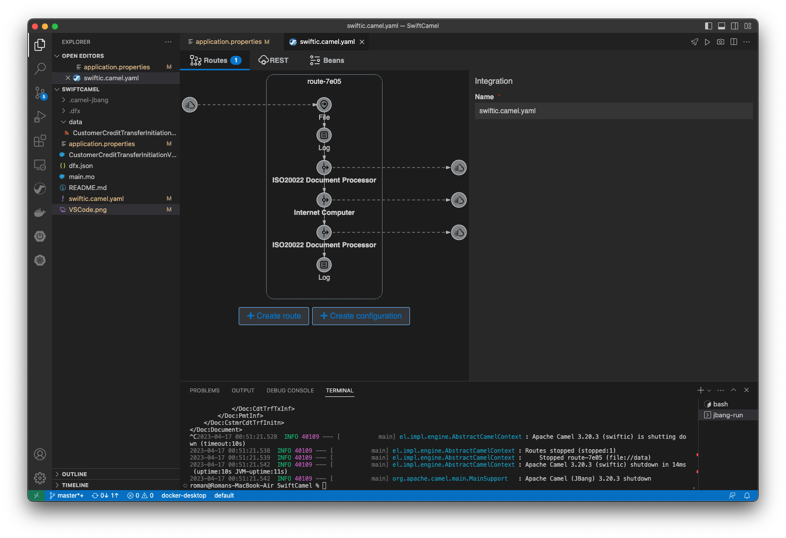

# IC4J Camel Component sample calling the IC canister with Swift ISO20022 document.

This application requires Java version 11.

In this sample we demonstrate how to use [Apache Camel] (https://camel.apache.org/) and [IC4J Camel Component] (https://github.com/ic4j/ic4j-camel) to invoke IC smart contract with ISO20022 payload ([CustomerCreditTransferInitiation](https://www.iso20022.org/iso-20022-message-definitions)). 
Motoko types representing Swift documents are generated from ISO20022 XML definition. The Java client then uses JAXB serializer and deserializer to convert [Prowide JAXB XML Objects](https://github.com/prowide/prowide-iso20022) to Candid types and back.

The sample reads ISO20022 XML payload from XML file, converts XML to JAXB using [Prowide library](https://dev.prowidesoftware.com/SRU2022/) and calls IC smart contract with Motoko payload. The smart contract then simply returns the same data back.


We used [Apache Karavan Visual Studio Code plug-in](https://github.com/apache/camel-karavan) to develop the Camel route, without needing to write any code.


### Deploy IC canister locally 
To run this sample start local IC instance in background using dfx tool

```
dfx start –background
```

Canister source code is in [main.mo](main.mo) file. Generated Motoko ISO20022 compatible types are in [CustomerCreditTransferInitiationV03Types.mo](CustomerCreditTransferInitiationV03Types.mo) file. To install the sample canister run dfx deploy command in this directory.

```
dfx deploy
```

Modify [application.properties](application.properties) file to set canister location and id.

```
ic.location=http://127.0.0.1:4943/
ic.canister=su63m-yyaaa-aaaaa-aaala-cai
```

Run Gradle [build](build.gradle). Modify Java version in the build file if higher than 1.8.

```
gradle build
```

Then run Camel application using [Jbang tool](https://www.jbang.dev/)

```
jbang -Dcamel.jbang.version=3.20.1 camel@apache/camel run swiftic.camel.yaml 
```

